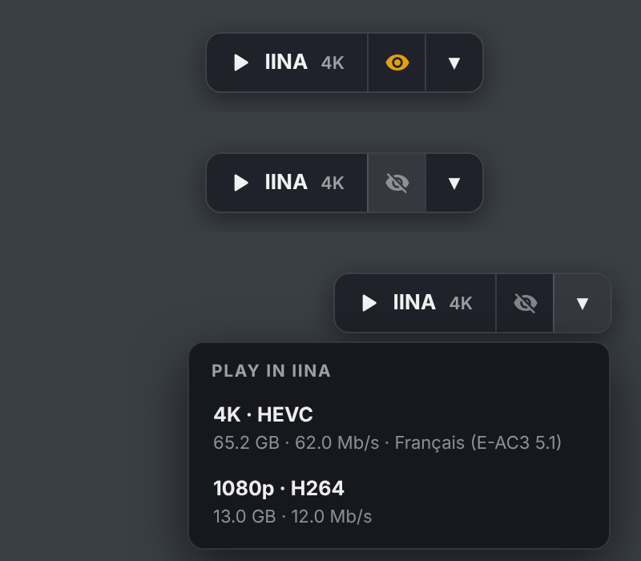

# Plex Sync for IINA ▶👁️

Play your Plex films and episodes in [IINA](https://github.com/iina/iina) straight from Plex Web, **and let Plex know what you watched**: progress, resume point, "Continue Watching", and marked as watched at the end.

IINA plays the original file from your server: no transcoding, every audio and subtitle track, the native macOS player. An eye on the button decides whether Plex keeps track or not.

> ⚠️ Experimental and vibe-coded: use it at your own risk!

## Install

You'll need a Mac with IINA 1.4 or later, and Plex Web in a browser with a userscript manager (Brave, Chrome, Safari, Firefox…).

1. **The IINA plugin**, either way:
   - In IINA: **Settings › Plugins › Install from GitHub**, then type `PyroDzeus/iina-plex-sync`. This way IINA also tells you when there's an update.
   - Or download [`iina-plex-sync.iinaplgz`](https://github.com/PyroDzeus/iina-plex-sync/raw/main/iina-plex-sync.iinaplgz) and double-click it.

   IINA asks you to allow network requests: that's how the plugin talks to your Plex server.
2. **The userscript:** install the [Violentmonkey](https://violentmonkey.github.io/) extension, then click [**Install Plex to IINA**](https://raw.githubusercontent.com/PyroDzeus/iina-plex-sync/main/plex-to-iina.user.js) and confirm. It updates automatically.

Open a film or an episode in Plex Web: the button sits at the top right.

## Settings

In **IINA › Settings › Plugins › Plex Sync**:
- **Resume** where Plex left off (on by default)
- **On-screen messages** ("Plex: tracking on", "resuming at 12:34", "marked as watched")
- **Watched threshold**: 90 % by default. Use the same value as your server's "Video played threshold" in Plex settings
- **How often** the position is sent: every 10 s by default

## What the plugin sends, and where

Nothing is sent anywhere except **your own Plex server**, and only for links opened with the eye on. Every other file you play in IINA is ignored.

- The userscript adds the item's Plex ID to the link it gives IINA (`…?X-Plex-Token=…&psk_rk=12345`). Plex ignores that extra parameter; the plugin looks for it. No ID, no tracking.
- The plugin then calls three Plex endpoints on the server the video comes from, with the token that came with the link:
  - `/library/metadata/{id}`: duration and resume point
  - `/:/timeline`: playing / paused / stopped and the position
  - `/:/scrobble`: mark as watched, only if Plex hasn't already done it itself, so a view is never counted twice

**Permissions** (in `Info.json`): `network-request` and `show-osd` only. There's no `file-system`: the plugin can't read or write your files or run anything. `allowedDomains` is `*` because everyone's Plex server has a different address (local IP, `plex.direct`, your own domain…).

The whole plugin is three readable files: [`Info.json`](Info.json), [`index.js`](index.js) and [`pref.html`](pref.html). The `.iinaplgz` is just those three zipped.

## How it works

There are two small pieces, and you need both:

| Piece | What it does |
|---|---|
| **Plex to IINA** (userscript, in your browser) | Adds an **▶ IINA** button to every film and episode page in Plex Web. Click it and IINA opens the file. The **eye** next to it turns Plex tracking on or off, and **▾** lets you pick a version (4K, 1080p…) |
| **Plex Sync** (IINA plugin) | While IINA plays, reports the position to your Plex server, resumes where Plex left off, and marks the item as watched past 90 % |

- 👁️ **Orange eye:** Plex records what IINA plays, as if you'd watched it in Plex.
- 🙈 **Crossed-out eye:** IINA plays without telling Plex anything. Handy to check a file without touching your history.

## Limitations

- macOS only (IINA is a Mac app).
- Audio and subtitle choices you make in IINA aren't saved back to Plex.
- The IINA window title shows the file link, including your Plex token: don't post screenshots of it publicly.

## Want more? Plex Sidekick

This repo is a **stripped-down, IINA-only version** of [**Plex Sidekick**](https://github.com/PyroDzeus/userscripts), part of my [userscripts](https://github.com/PyroDzeus/userscripts) for Plex Web. Sidekick does the same IINA playback with the same eye switch, plus links to 20+ film sites (TMDB, IMDb, Letterboxd, Blu-ray.com…), other players (Infuse, mpv, VLC, PotPlayer), next episode, 7 button styles and more.

Already using Plex Sidekick 6.2 or later? Don't install the userscript from here: just install the **Plex Sync** plugin, it works with both.

## License

[MIT](LICENSE): free to use, modify and share.
